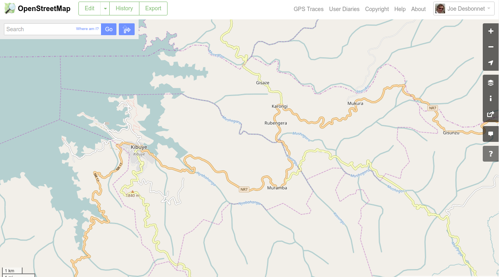

# CongoNileTrailMyTracks

Google MyTracks app track logs from walking parts of the Congo Nile Trail (along eastern side of Lake Kivu, Rwanda). 
December 2015. Open data: do what you like with this. No attribution required.

I used this data to update a minor road leading from the NR17 main road to the Gisovu tea factory on Open Street Map:

